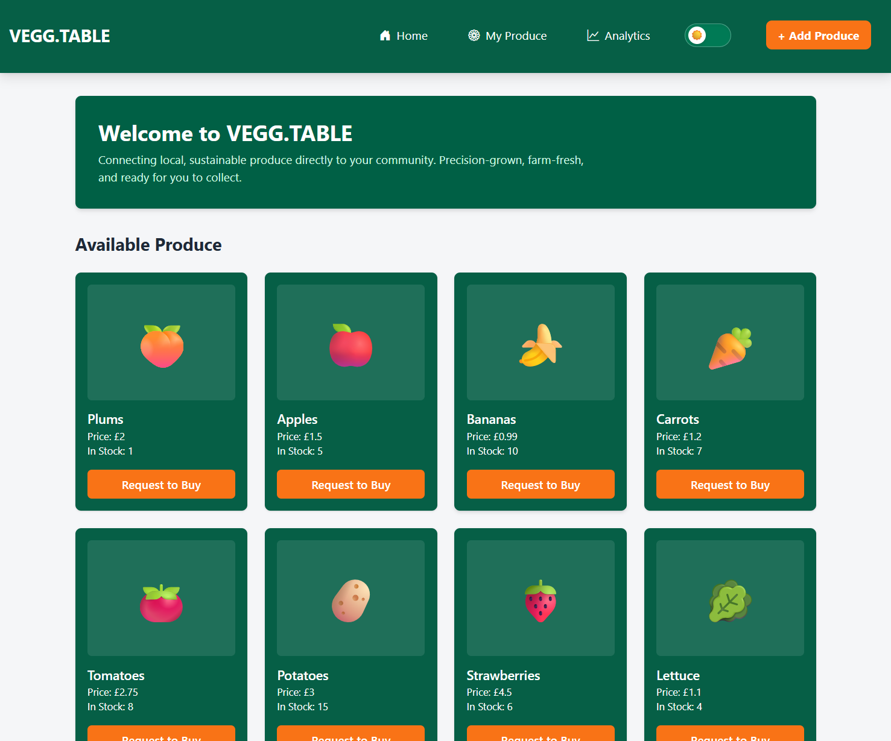

# Welcome to VEGG.TABLE
VEGG.TABLE is a peer-to-peer marketplace for community grown foodstuffs. 
To promote sustainable microproduce and community food resilience. We provide a platform for local producers to sell the crops, garden plants and foodstuffs that they grow in the community to the community around them.

Our whiteboard: [Figma Board](https://www.figma.com/board/jRS3cdT5qpY0piIOLnXisa/VEGG.TABLE?node-id=0-1&p=f&t=Jq6VlaDEQLm4XsCp-0) \
Our Architecture : [Architecture](./Architecture.md)
---

## Running the Project

During the development phase we are using Docker containeristaion to run our Web-application on a range of machines. We are using an MSSQL server which should run locally on your machine.
**The running the project instructions will not function on a Windows machine using ARM rather than AMD architecture.**

Please follow these steps in order to ensure all services are correctly initialized:
1. After cloning the repo open the project in visual studio 2026. 
2. Open DockerDesktop.
3. Open a powershell terminal in root directory in visual studio 2026. 

4. Run:

```bash
docker compose up --build -d
```

5. Verify containers:

```bash
docker compose ps
```

   - Our Docker.yml script will create an SQL Server container, ensuring the database is active (Docker Desktop must be running).
   - The Script will then set the API project in the solution as the startup project.
   - Npm.js will be downloaded and installed by the docker script and starting the tailwind CSS manager.
   - Each project in the solution will now run.
   
6.Open browser http://localhost:5209 to run the Blazor frontend 

- Open browser http://localhost:5167/scalar/v1 to view API calls

## Windows ARM (Snapdragon) Users

SQL Server Docker images currently do not run reliably on ARM devices. If using a ARM device there will be no need to set up a docker image however you will likely need to setup a private online server with a service such as Microsoft Azure or simply use a virtual machine running x64 Windows.

If using Azure SQL:

First Clone the repository to your machine and open the solution using visual studio 2026.

Manually install  Nodejs at https://nodejs.org/en/download. 
Openpowershell in the root directory and run. npm and nodejs are required in order to ensure that the tailwind CSS generation works. (more on that [here](./Architecture.md)
```npm install 

Use the connection string to you own online server to establish a database linkage by using your connection string which follows the pattern :
Server=<your-server>.database.windows.net;
Database=<your-database>;
User Id=<your-admin-user>;
Password=<your-password>;
TrustServerCertificate=True;
Encrypt=False;

Replace the default connection string in appsettings.JSON with your connection string.
To migrate the database to your virtual server run the following two commands in powershell:

```dotnet ef migrations add InitialCreate ` --project .\src\VEGG.TABLE.Infrastructure\VEGG.TABLE.Infrastructure.csproj ` -- startup-project .\src\VEGG.TABLE.API\VEGG.TABLE.API.csproj
 ``` dotnet ef database update --project .\src\VEGG.TABLE.Infrastructure\VEGG.TABLE.Infrastructure.csproj --startup-project .\src\VEGG.TABLE.API\VEGG.TABLE.API.csproj

   ```npm run install
   ```dotnet build --project .\src\VEGG.TABLE.API\VEGG.TABLE.API.csproj run
   ```dotnet watch --project .\src\VEGG.TABLE.Client\VEGG.TABLE.Client.csproj run

## Dependencies

We are using NET10.0 architecture using the most up to date dependencies available in 2026.

node.js is required 
and running npm install


### Our Team of VEGG.TABLE creators

* [Khalos M](https://github.com/khalosmoscato)
* [Jinlue "Leo" Z](https://github.com/Leoreoreoreo)
* [Vladimir S](https://github.com/VladStam)
* [Leao B](https://github.com/lleaob)
* [Chloe R-B](https://github.com/chloerb97)


